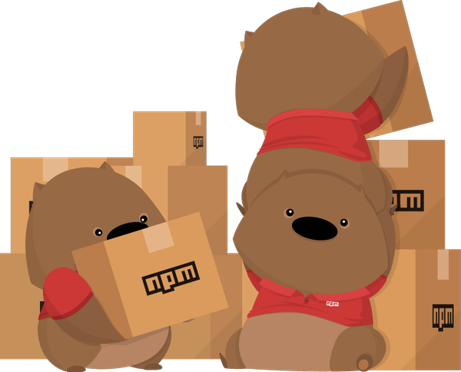
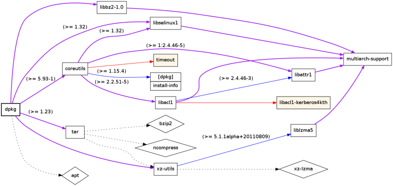
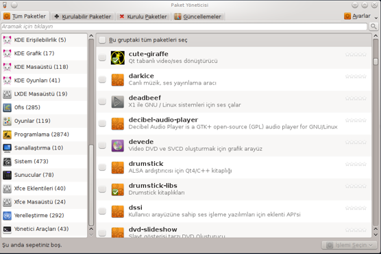
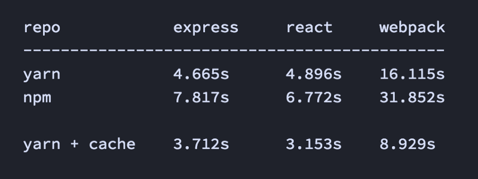
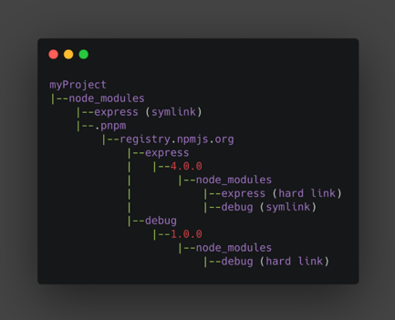

## Paketlere ve Paket Yöneticilerine Neden İhtiyaç Duyarız?

Biz yazılım geliştiricileri genelde her şeyi sıfırdan geliştirmek yerine, mevcut açık kaynak paketleri kullanmayı tercih ediyoruz.

Bu paketlerin her birinin kendi topluluğu ve geliştiricileri var.

Projelerimizde açık kaynak paket kullanmak bize daha hızlı geliştirme ve daha iyi güvenlik gibi avantajlar sağlıyor.

Hoş bir npm paket görseliyle yazımıza başlayalım.

Bir paketin düzgün çalışabilmesi için bir çok pakete bağımlı olması gerekebilir. Benzer şekilde diğer paketlerin kendisi de başka paketlere bağımlı olabilir. Bu şekilde iç içe geçmiş bağımlılıklar bazen o kadar karmaşık hale gelebilir ki bağımlılıkların yönetimini manuel olarak gerçekleştiremeyiz.

Aşağıdaki görselde iç içe geçmiş paket bağımlılıklarının karmaşıklığını görebilirsiniz.

Burada imdadımıza paket yöneticileri koşuyor.

Paket yöneticileri projenin bağımlılıklarını otomatik olarak yöneten araçlardır.

Örneğin bir paket yöneticisi tek bir komutla yeni paketleri kurabilir veya mevcut paketleri güncelleyebilir. Her şey otomatik olduğundan insan hatası olasılığı yoktur.

Aşağıdaki görselde [Pardus](https://www.pardus.org.tr/) işletim sisteminin PiSi (Package Installed Succesfully as Intended) paket yöneticisini görebilirsiniz.

# JavaScript Paket Yöneticileri

Bugün paket yöneticileri alanında üç büyük oyuncu var:
- npm
- Yarn — Kısa bir süre sonra Yarn'ın Yarn Classic (< v2) ve daha modern versiyonu olan Yarn Berry (≥ v2) hakkında konuşacağız.
- pnpm (performant npm / performanslı npm)

Neredeyse tüm paket yöneticileri arasında özellik eşliği elde ettik. Bu nedenle, kurulum hızı, depolama tüketimi veya mevcut iş akışınızla nasıl örtüştüğü gibi işlevsel olmayan gereksinimlere göre hangi paket yöneticisinin kullanılacağına büyük olasılıkla siz karar vereceksiniz.

Elbette, her bir paket yöneticisini nasıl kullanmayı seçeceğiniz farklılık gösterecektir, ancak hepsi bir dizi ana kavramı paylaşmaktadır. Bu paket yöneticilerinden herhangi biriyle aşağıdakileri yapabilirsiniz:
- Meta verileri işleme ve yazma,
- Tüm bağımlılıkları toplu olarak yükleme, güncelleme veya kaldırma,
- Komut dosyalarını çalıştırma,
- Paketleri yayınlama,
- Güvenlik denetimleri gerçekleştirme.

## JavaScript Paket Yöneticilerinin Kısa Bir Geçmişi
Şimdiye kadar piyasaya sürülen ilk paket yöneticisi, Ocak 2010'da npm idi. Paket yöneticilerinin bugün nasıl çalıştığının temel ilkelerini oluşturdu.

### npm

npm, paket yöneticilerinin atasıdır.

Yayınlanması bir devrim oluşturdu çünkü o zamana kadar proje bağımlılıkları **manuel** olarak indirilip yönetiliyordu. Meta veri alanlarıyla birlikte **package.json** dosyası (ör. devDependencies), **node_modules**'ta bağımlılıkları depolamak, özel komut dosyaları, genel ve özel paket kayıtları ve daha fazlası gibi kavramların tümü npm tarafından tanıtıldı.

2010'da yayınlandıktan kısa süre sonra resmi olarak Node.js takımı tarafından sahiplenildi, bu da npm'in dönüm noktası oldu. Node.js'in büyük başarısından sonra geliştirici topluluğu npm'e de ilgi göstermeye başladı.

2020'de **GitHub** npm'i satın aldı, bu nedenle prensipte npm artık **Microsoft**'un yönetimi altında. Bu yazının yazıldığı sırada, en son ana sürüm Ekim 2021'de yayınlanan **v8**'dir.

### Yarn (v1 / Classsic )

Ekim 2016'daki bir blog gönderisinde **Facebook**, npm'nin o sırada sahip olduğu tutarlılık, güvenlik ve performans sorunlarıyla ilgili sorunları çözecek yeni bir paket yöneticisi geliştirmek için **Google ve birkaç şirketle** ortak bir çalışma yürüttüğünü duyurdu.

Yarn'ın mimari tasarımını npm'nin oluşturduğu birçok kavram ve sürece dayandırsalar da Yarn, ilk sürümünde paket yöneticisi ortamı üzerinde büyük bir etkiye sahipti. Yarn, npm'nin aksine, npm'nin ilk sürümleri için önemli bir sorun olan kurulum sürecini hızlandırmak için operasyonları (paket indirme, kurma vb.) **paralel** hale getirdi.

Yarn, güvenlik ve performans için çıtayı daha yükseğe koydu ve ayrıca aşağıdakiler dahil birçok kavramı icat etti:
- Yerel monorepo desteği
- Önbelleğe duyarlı yüklemeler
- Çevrimdışı önbelleğe alma
- Dosyaları kilitleme

Aşağıdaki görselde Yarn Classic ve npm benchmark karşılaştırmasını görebilirsiniz.

Yarn v1, 2020'de bakım moduna girdi. O zamandan beri v1.x serisi miras olarak kabul edildi ve adı Yarn Classic olarak değiştirildi. Yerine Yarn v2 veya Berry, artık aktif geliştirme dalıdır.

### pnpm

pnpm'in 1. versiyonu, 2017 yılında **Zoltan Kochan** tarafından piyasaya sürüldü.

pnpm yaratıcılarının npm ve Yarn ile ilgili temel sorunu, projelerde kullanılan bağımlılıkların fazla depolanmasıydı. Yarn Classic, npm'e göre hız avantajlarına sahip olsa da, pnpm yaratıcıları için bu yeterli değildi.

pnpm bağımlılıkların depolanmasına alternatif bir strateji sundu: içerik adreslenebilir depolama. Bu yöntem, paketleri global bir mağazada (**~/.pnpm-store/**) depolamaya dayalıdır. Bir bağımlılığın her sürümü fiziksel olarak o klasörde yalnızca bir kez saklanır, tek bir doğruluk kaynağı oluşturur ve oldukça fazla disk alanından tasarruf sağlar. Bir bağımlılık kullanılmak istendiğinde proje klasörümüzdeki sembolik bağlantı sayesinde global mağazadan paket çekilir.

Aşağıdaki görselde pnpm'in sağladığı sembolik link yapısını görebilirsiniz.

### Yarn (v2, Berry)

Yarn v2, Ocak 2020'de piyasaya sürüldü. Yarn ekibi, esasen yeni bir kod tabanı ve yeni ilkelere sahip yeni bir paket yöneticisi olduğunu daha açık hale getirmek için Yarn Berry olarak adlandırdı başladı.

Yarn Berry'nin ana yeniliği, node_modules'ı düzeltmek için bir strateji olarak ortaya çıkan Plug'n'Play (PnP) yaklaşımıdır. node_modules (iç içe klasör yapısı) oluşturmak yerine, tek bir dosya olduğu için daha verimli işlenebilen bağımlılık arama tablolarına sahip bir **.pnp.cjs** dosyası oluşturulur. Ayrıca her paket, node_modules klasöründen daha az disk alanı kaplayan **.yarn/cache/** klasörünün içinde bir **zip dosyası olarak saklanır.**

Yarn v2 tüm bu değişiklikler ve çok hızlı bir şekilde piyasaya sürülmesiyle büyük tartışmalara yol açtı. PnP'nin son değişiklikleri, geliştiricilerin mevcut paketlerini onunla uyumlu hale getirmek için güncellemelerini gerektirdi. Yeni PnP yaklaşımı varsayılan olarak kullanıldı ve node_modules'a geri dönmek başlangıçta kolay değildi, bu da birçok önde gelen geliştiricinin Yarn 2'yi seçmediği için açıkça eleştirmesine yol açtı.

Yarn Berry ekibi, sonraki sürümlerinde birçok sorunu ele aldı. PnP'nin uyumsuzluğunu gidermek için ekip, varsayılan çalışma modunu kolayca değiştirmenin bazı yollarını önerdi. Bir node_modules eklentisinin yardımıyla, geleneksel node_modules yaklaşımı kullanılabilinir hale getirildi.

## Paket Yöneticilerinin Popüler Projeler Tarafından Benimsenmesi

| npm | Yarn Classic | Yarn Berry | pnpm |
|--|--|--|--|
| [Svelte](https://github.com/sveltejs/svelte) | [React](https://github.com/facebook/react) | [Jest (node_modules) ile](https://github.com/facebook/jest) | [Vue 3](https://github.com/vuejs/vue-next) |
| [Preact](https://github.com/preactjs/preact) | [Angular](https://github.com/angular/angular) | [Storybook (node_modules) ile](https://github.com/storybookjs/storybook) | [Browserslist](https://github.com/browserslist/browserslist) |
| [Express.js](https://github.com/expressjs/express) | [Ember](https://github.com/emberjs/ember.js) | [Babel (node_modules) ile](https://github.com/babel/babel) | [Prisma](https://github.com/prisma/prisma) |
| [Meteor](https://github.com/meteor/meteor) | [Next.js](https://github.com/vercel/next.js) | [Redux Toolkit (node_modules) ile](https://github.com/reduxjs/redux-toolkit) | [SvelteKit](https://github.com/sveltejs/kit) |
| [Apollo Server](https://github.com/apollographql/apollo-server) | [Gatsby](https://github.com/gatsbyjs/gatsby) |  |  |
|  | [Nuxt](https://github.com/nuxt/nuxt.js) |  |  |
|  | [Create React App](https://github.com/facebook/create-react-app) |  |  |
|  | [webpack-cli](https://github.com/webpack/webpack-cli) |  |  |
|  | [Emotion](https://github.com/emotion-js/emotion) |  |  |

İlginç bir şekilde, bu yazının yazıldığı sırada bu açık kaynak projelerinin hiçbiri bir PnP yaklaşımını kullanmıyor.

## Sonuç

Paket yöneticilerinin mevcut durumu şuan için harika. Tüm büyük paket yöneticileri arasında neredeyse **özellik eşliğine ulaştık**. Ama yine de, kaputun altında biraz farklılar var.

pnpm, CLI kullanımları benzer olduğu için ilk başta npm'e benzer, ancak bağımlılıkları yönetme konusunda çok farklıdır; pnpm'in yöntemi daha iyi performans ve en iyi disk alanı verimliliği sağlar. Yarn Classic hala çok popülerdir, ancak eski bir yazılım olarak kabul edilip yakın gelecekte destek kaldırılabilir. Yarn Berry PnP, bloktaki yeni çocuk, paket yöneticisi ortamında bir kez daha (ilk devrimi npm'in yaptığını hatırlarsak) devrim yaratma potansiyelini tam olarak anlamadı.

Bu makalenin amacı, hangi paket yöneticisini kendi başınıza kullanacağınıza karar vermeniz için size birçok bakış açısı sunmaktır. Belirli bir paket yöneticisini önermediğimi belirtmek isterim. Bu, farklı gereksinimleri nasıl değerlendirdiğinize bağlıdır - yine de istediğinizi seçebilirsiniz!

## Kaynaklar
https://blog.logrocket.com/javascript-package-managers-compared/

https://medium.com/innovance-company-blog/npm-vs-yarn-vs-pnpm-f71796b9b085

https://javascript.plainenglish.io/npm-yarn-pnpm-which-node-js-package-manager-should-you-use-a2a1378694f7

https://www.kochan.io/nodejs/why-should-we-use-pnpm.html

https://www.npmjs.com/

https://yarnpkg.com/

https://pnpm.io/